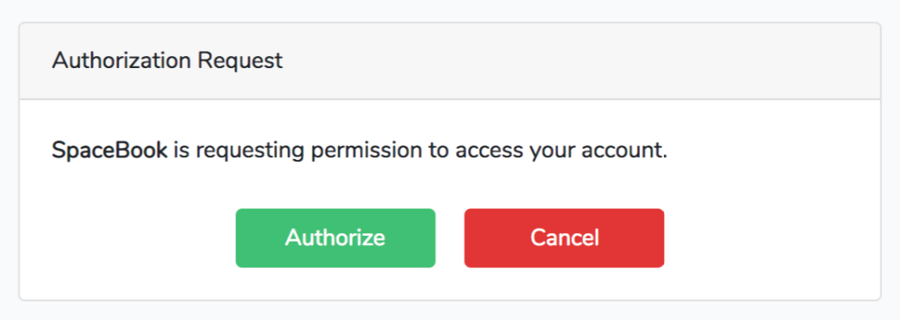

# Passport的有效授权类型

Passport使您能够以四种不同的方式对用户进行身份验证。两个是传统的oauth 2.0授权（密码授权和授权码授权），两个是passport特有的便利方法（个人令牌和同步器令牌）。

**密码授权**

密码授权虽然不如授权码授权常见，但要简单得多。如果您希望用户能够使用其用户名和密码直接使用您的api进行身份验证，例如，如果您的公司有一个移动应用程序正在使用您自己的api，则可以使用密码授权。

> 创建一个密码授权客户端
>
> 为了使用密码授予流，您需要数据库中的密码授予客户端。这是因为对oauth服务器的每个请求都需要由客户端发出。通常，客户端会识别用户正在针对哪个应用程序或站点进行身份验证，例如，如果您使用Facebook登录到第三方网站，则该网站将是客户端。
>
> 对于密码授权，伴随着请求没有客户端进来，因此您必须创建一个，这就是密码授予客户机。在运行php artisan passport:install时会添加一个，但是如果出于任何原因需要生成新的密码授予客户机，可以执行以下操作。

```bash
$php artisan passport:client --password
What should we name the password grant client?
[My Application Password Grant Client]:
> Client_name
Password grant client created successfully.
Client ID: 3
Client Secret: Pg1EEzt18JAnFoUIM9n38Nqewg1aekB4rvFk2Pma
```

对于密码授予类型，获得令牌只有一个步骤：将用户凭据发送到/oauth/token路由，如例13-30所示。



```php
// Routes/web.php in the *consuming application*
Route::get('tweeter/password-grant-auth', function () {
    $http = new GuzzleHttp\Client;
    // Make call to "Tweeter," our Passport-powered OAuth server
    $response = $http->post('http://tweeter.test/oauth/token', [
        'form_params' => [
            'grant_type' => 'password',
            'client_id' => config('tweeter.id'),
            'client_secret' => config('tweeter.secret'),
            'username' => 'matt@mattstauffer.co',
            'password' => 'my-tweeter-password',
            'scope' => '',
        ],]);
    $thisUsersTokens = json_decode((string)$response->getBody(), true);
    // Do stuff with the tokens
});
```



此路由将返回访问令牌和刷新令牌。现在，您可以保存这些令牌，以便使用api（访问令牌）进行身份验证，并在以后请求更多令牌（刷新令牌）。

请注意，用于密码授权类型的id和secret将是passport应用程序的oauth\_clients数据库表中与passport授予客户端名称匹配的行中的id和secret。当你运行passport:install你将在数据表中看到默认生成两个客户端：“Laravel Personal Access Client” 和 “Laravel Password Grant Client.”

**授权码授权**

最常见的OAuth 2.0 auth工作流也是Passport支持的最复杂的工作流，假设我们正在开发一个类似于twitter但用于声音剪辑的应用程序；我们称之为tweeter。我们可以想象另一个网站，一个科幻迷的社交网络，叫做SpaceBook，SpaceBook开发者想要人们嵌入Tweeter数据到他们的SpaceBook newsfeeds中，我们将安装Passport在我们的Tweeter app中，可以允许他们的用户使用他们的tweeter信息进行身份验证。

在授权码授权中，每个网站-示例中的SpaceBook网站需要创建一个客户端，在大多数情况下，其他网站的管理员需要在Tweeter注册有账号，然后我们需要为他们创建客户端构建工具，对于开发商了来说，我们需要手动创建客户端用于SpaceBook管理。

```bash
$php artisan passport:client
Which user ID should the client be assigned to?:
>1
What should we name the client?:
> SpaceBook
Where should we redirect the request after authorization?
[http://tweeter.test/auth/callback]: > http://spacebook.test/tweeter/callback
New client created successfully.
Client ID: 4
Client secret: 5rzqKpeCjIgz3MXpi3tjQ37HBnLLykrgWgmc18uH
```

每个客户端都需要分配给应用程序中的用户。假设用户1正在编写SpaceBook；他们将是我们正在创建的这个客户端的“所有者”。

现在我们有了SpaceBook客户端的ID和秘钥。 此时，SpaceBook可以使用此ID和秘钥来构建工具，允许单个SpaceBook用户（也是Tweeter用户）从Tweeter获取auth令牌，以便SpaceBook对该用户的Tweeter的API进行调用。 例13-31说明了这一点。 （此示例和以下示例假设SpaceBook也是Laravel应用程序;他们还假设Spacebook的开发人员在config / tweeter.php创建了一个文件，该文件返回我们刚创建的ID和秘钥。）



```php
// In SpaceBook's routes/web.php:
Route::get('tweeter/redirect', function () { 
        $query = http_build_query([
                'client_id' => config('tweeter.id'),
                'redirect_uri' => url('tweeter/callback'),
                'response_type' => 'code',
                'scope' => '',
        ]);
        // Builds a string like:
        // client_id={$client_id}&redirect_uri={$redirect_uri}&response_type=code
        return redirect('http://tweeter.test/oauth/authorize?' . $query); 
});
```



当用户在SpaceBook点击该路由，他们将被重定向到Tweeter 的/oauth/ 授权Passport路由，此时将会看到一个确认页，你可以通过运行以下命令使用默认的passport确认页。

```bash
php artisan vendor:publish --tag=passport-views
```

这将发布视图到resources/views/vendor/passport/authorize.blade.php，然后用户将看到如图13-1所示的页面。



