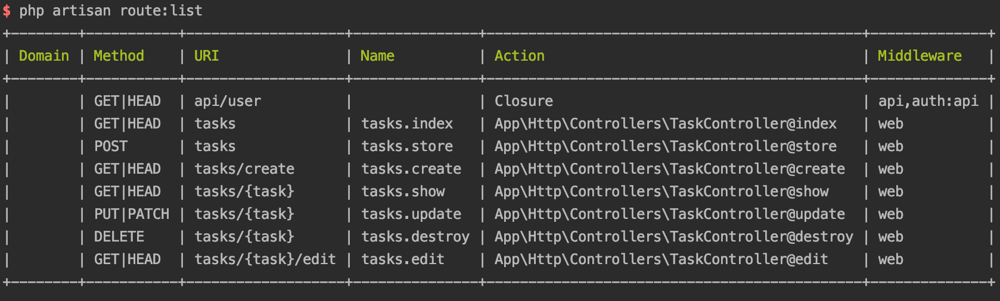

# 资源控制器

有时在控制器中命名方法可能是编写控制器最难的部分。 值得庆幸的是，Laravel对传统REST / CRUD控制器的所有路由都有一些约定（在Laravel中称为“资源控制器”）; 此外，它还带有一个开箱即用的generator和一个便利路由定义，允许您立即绑定整个资源控制器

要查看Laravel生成的资源控制器方法，让我们从命令行生成一个新控制器

```bash
php artisan make:controller MySampleResourceController --resource
```

现在打开app/Http/Controllers/MySampleResourceController.php。你会看到它有很多方法。让我们回顾一下每一个代表的含义。我们将以任务为例

**资源控制器的方法**

还记得之前的表格么?表格3-1显示了HTTP verbs,URL,控制器名字,以及Laravles资源控制器生成的默认方法名.

**绑定资源控制器**

因此，我们已经看到这些是在Laravel中使用的常规路由名称，并且很容易为每个默认路由生成一个带有方法的资源控制器。谢天谢地，您不必手动为每个控制器方法生成路由。这有一个技巧，叫做`resource controller binding`。请看示例3-28



```php
Route::resource('tasks','TaskController');
```



这将进行全自动绑定,例如资源控制的index\(\)会绑定成tasks.index\(\)

> artisan route:list
>
> 如果您发现自己处于一种不知道当前应用程序有哪些可用路由的情况下，有一个工具可以实现这一点：从命令行运行php-artisan-route:list，您将得到所有可用路由的列表（参见图3-2）。



