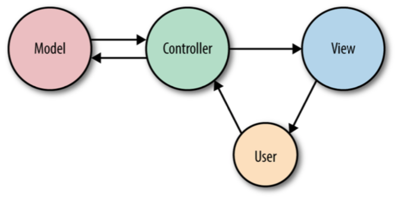

# 什么是MVC

MVC 包含三个概念:

_模型_

表示单个数据库表（或该表中的记录） - 想象一下“公司”或“狗”

_视图_

表示把你的数据通过模板输出给用户,想象成“用HTML&CSS&Javascript构成的HTML登录页面模板”

_控制器_

像交通警察一样，从浏览器接收HTTP请求，从数据库和其他存储机制中获取正确的数据，验证用户输入，最后将响应发送回用户

在图3-1中可以看出用户首先通过浏览器发送HTTP请求与控制器进行交互,这时控制器响应请求,然后从模型\(database\)读写数据,然后控制器把数据发送给视图,最终视图通过浏览器展示给用户

我们将介绍Laravel一些用例,这些例子看起来不太符合这种架构,不必把注意力都集中到MVC上,但是,当我们谈论视图和控制器时,这至少会让你准备好接受本章的其余部分

