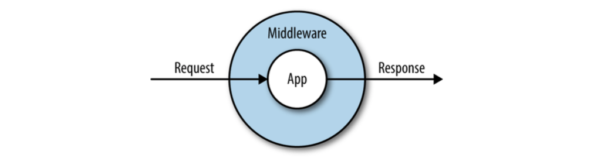

# Laravel的请求生命周期

进入Laravel应用程序的每个请求，无论是由HTTP请求还是命令行交互生成的，都会立即转换为一个Illuminate请求对象，然后跨越许多层，最后由应用程序本身解析。然后，应用程序生成一个Illuminate响应对象，该对象在这些层中被发送出去，最后返回给最终用户。

这个请求/响应生命周期如图10-1所示。让我们来看一下，从第一行代码到最后一行，每一个步骤都是如何实现的。

